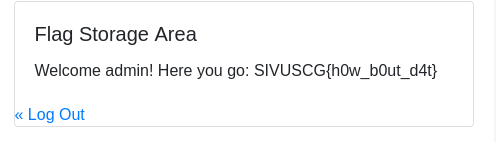

# Writeup
## Analysis

This web server is very simple, there are really only three pages: register, login, and dashboard. The challenge of this is to log in with an account that isnt user so that the template file **dashboard.html** gives us the flag:
```html
<h5 class="card-title">Flag Storage Area</h5>
<p class="card-text">
    
        Sorry, you are logged in as "{{ role }}", no flag for you!
    
        Welcome admin! Here you go: {{ FLAG }}
    
</p>
```
## Solution 

An important thing to note about the **dashboard.html** is that it checks to make sure that your role is not user, not that your role is admin. This will be important later. <br />
The first odd thing that stood out to me is this chunk in the register function of **main.py**
```python
# Make sure that username isn't in password, for security reasons
matches = re.match(username,password)

if matches:
    redis.delete(f"user:{username}:role")
    redis.delete(f"user:{username}:password")
    return jsonify({"error": "Username can't be in password."}), 400
```
This is very unusual and the fact that it checks it with a regex instead of an in statement is even more odd. The problem with this is that it entering untrusted user input into a regex without verification or character stripping. This opens it up to an attack called a ReDoS which causes a Denial of Service by forcing the server to execute a very complex regular expression, more on that [here](https://book.hacktricks.xyz/pentesting-web/regular-expression-denial-of-service-redos). But we are not looking for a DoS so I kept looking. <br />
Remember the bit about the template file? Well look at this:
```python
redis.set(f"user:{username}:role", "unverified")
redis.set(f"user:{username}:password", generate_password_hash(password))
```
This code is right above the previous one and sets the role of a user to unverified when they are being created, and it is set to user once the user is sucessfully created. The astute will notice that unverified is markedly *NOT* the same thing as user. So if we can log in with the role still as unverified it should spit out the flag. But how to do this? Well remember how I said that the regex is right below the block that creates the user? Well if we can get it to stall out at the regex and log in, that should give the flag. Well I could have it execute a DoS and try to get a race condition so that I log in while it is still atempting to execute the regex. This would work, in theory, but the timing of that is very precice and there is an easier way. Notice that the regex doesn't have any error handing around it. So if it runs into an error on that line the user should keep the role of unverified. To thow an error I need to execute an illegal regex. A simple one is `)` just a closing parentisies without an opener. So I registered with a username of `)` and a password of `password123` (the best password) and got no confirmation that the user was created. This means that it errored out before being able to print that message. Logging in with these creds gives me the flag.



Flag: `SIVUSCG{h0w_b0ut_d4t} `